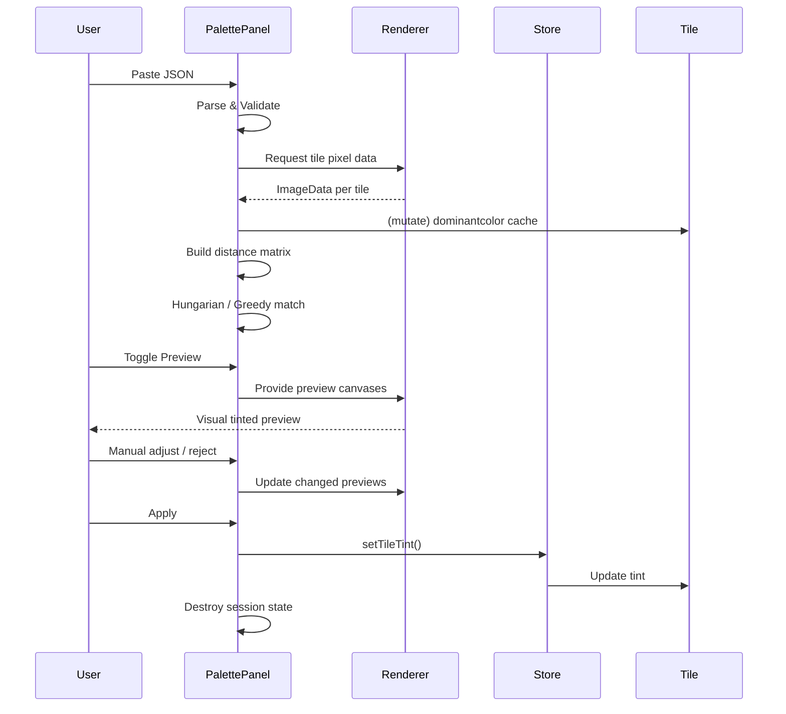
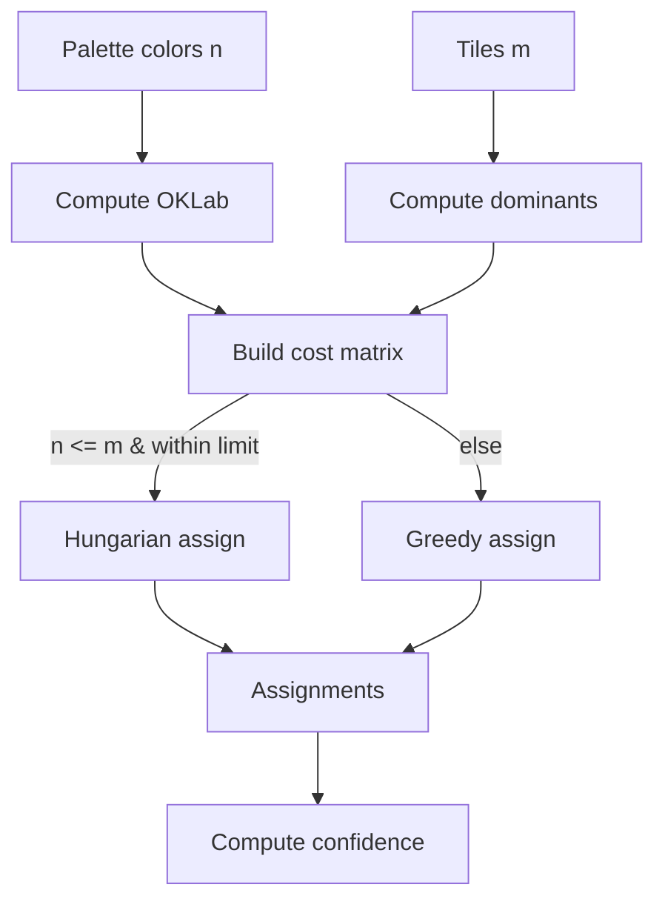
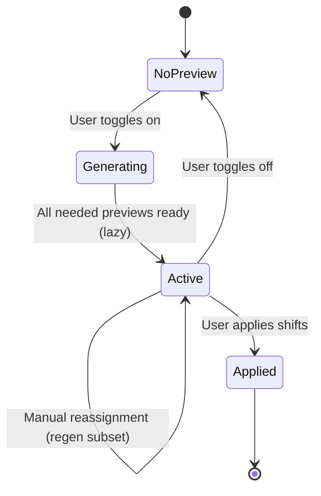
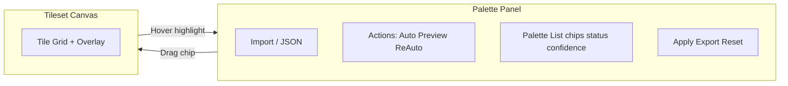
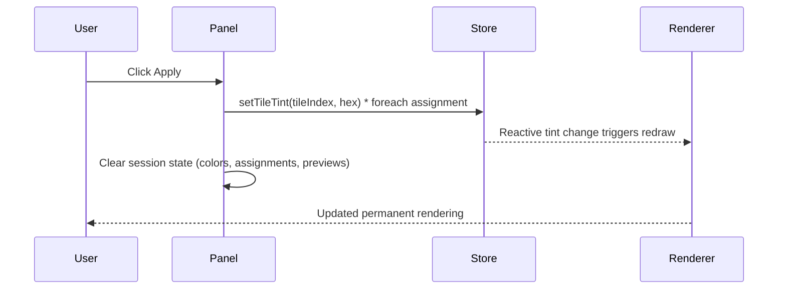

# Feature: Color Palette Import, Auto Match & Apply (Destructive Shift)

## User Story
As a pixel artist working with a tileset, I want to paste a JSON color palette and have Tile Mate intelligently match each palette color to the tiles whose dominant colors are closest, so I can preview, adjust, accept or reject mappings, and then recolor the tiles in one batch—speeding up palette swaps and experimentation. Once applied, shifts are permanent and future palette operations build on the already-shifted colors.

---

## Specification

### 1. Purpose
Enable users to paste a JSON color palette, auto‑match colors to tiles based on current (post‑shift) dominant colors, preview non-destructive recolors, manually adjust, then permanently apply shifts (updating `tile.tint`). All palette/UI state is ephemeral; only committed tints persist.

### 2. Scope (In / Out)
**In:** palette import, validation, auto match (Hungarian / greedy), preview, manual reassignment, reject/restore, apply (destructive), export mapping, confidence scoring.
**Out:** persistent palette history, undo after apply, non-destructive multi-branch experimentation, original pixel preservation.

### 3. Data Structures
**Tile augmentation (runtime only, non-reactive):** `(tile as any).dominantcolor?: [r,g,b]` (current dominant). Stored via direct mutation, not serialized.

**Ephemeral palette session (component signals, not in store):**
```
type EphemeralPaletteColor = {
  id: string;
  name: string;
  hex: string; // #RRGGBB uppercase
  rgb: [number,number,number];
  oklab: [number,number,number];
  status: 'auto' | 'manual' | 'rejected' | 'unassigned';
  assignedTileIndex?: number;
  confidence?: number; // 0..1
  duplicateOf?: string; // canonical color id if duplicate hex
};

type EphemeralAssignment = {
  tileIndex: number;
  paletteId?: string;
  distance?: number;
  confidence?: number;
  previewCanvas?: HTMLCanvasElement;
  accepted: boolean; // true if assigned & not rejected
};

type PaletteSession = {
  rawInput: string;
  colors: EphemeralPaletteColor[];
  assignments: EphemeralAssignment[];
  previewActive: boolean;
  algo: 'hungarian' | 'greedy';
  hash: string; // signature of palette+dominants
  undoStack: UndoEntry[];
};

type UndoEntry =
  | { type: 'assign'; paletteId: string; prevTile?: number; newTile?: number }
  | { type: 'reject'; paletteId: string; prevStatus: string }
  | { type: 'restore'; paletteId: string; prevStatus: string }
  | { type: 'bulk'; snapshot: any };
```

### 3a. State Relationship Diagram

```mermaid
flowchart LR
  subgraph Session[Palette Session (Ephemeral)]
    RAW[rawInput]
    PC[PaletteColor[]]
    ASG[Assignment[]]
    PREV[previewActive]
    UNDO[undoStack]
  end
  subgraph Store[TileMateStore]
    TS[tilesets]
    TINT[tile.tint]
  end
  subgraph TileObj[Tile Object (runtime)]
    DOM[dominantcolor RGB]
  end
  RAW --> PC --> ASG --> PREV
  ASG -->|Apply| TINT
  TS --> TileObj
  TileObj --> DOM
  DOM --> ASG
```

> Diagram shows ephemeral session feeding assignments which only become persistent when `Apply` writes `tile.tint` into the store; dominant color cache remains non-reactive.

### 4. Functional Flow
1. User pastes palette JSON.
2. Parse & validate (object `{ name: hex }` or array `[hex,...]`). Normalize hex (#RRGGBB). Expand #RGB.
3. Deduplicate identical hex (mark later ones `duplicateOf`, status `unassigned`). Collect errors/warnings.
4. Ensure tile dominants: compute if missing/invalidated using current canvas pixels; store in `dominantcolor`.
5. Build distance matrix (palette ↔ tiles) using OKLab ΔE (fallback weighted HSL); apply grayscale penalty.
6. Auto assign (Hungarian if feasible; else greedy). Partial assignment allowed if palette > tiles.
7. Record assignments with distance + confidence (normalized 0..1).
8. Preview toggle On: lazily generate shifted preview canvases per assigned tile (non-destructive).
9. Manual reassignment: drag palette chip → tile (swap if occupied); status to `manual`; update previews lazily.
10. Reject color: status `rejected`, remove tile link (tile reverts to current pixels).
11. Restore: status `unassigned` (eligible for manual assignment or re-auto).
12. Optional Re-Auto for unassigned/auto colors.
13. Apply: for each accepted assignment set `tile.tint = palette.hex`; optionally recompute dominant; clear session state.
14. Export mapping (JSON) at any time before Apply.
15. Reset or Apply empties session (ephemeral memory cleared).

### 4a. End-to-End Flow Diagram



### 5. Distance & Confidence
- OKLab ΔE: `sqrt((ΔL)^2 + (Δa)^2 + (Δb)^2)`.
- Penalty: if tile saturation < 0.08 and palette saturation > 0.4 add +6 ΔE.
- Confidence: `1 - (ΔE / maxΔEObserved)` clamped to [0,1]. Buckets: High ≥0.75, Medium 0.5–0.75, Low <0.5.

### 6. Matching Algorithms
- Hungarian: pad rectangular matrix with large-cost dummy rows/cols; ignore dummy results.
- Greedy fallback (threshold: e.g. palette > 128 or n^3 > budget): sort palette by chroma desc; assign closest available tile.

### 6a. Matching Algorithm Illustration



ASCII heatmap concept (lighter = closer):

```
Palette →   Tile0  Tile1  Tile2  Tile3
ColorA       0.1    0.4    0.7    0.6
ColorB       0.5    0.2    0.8    0.9
ColorC       0.9    0.6    0.3    0.4
```
Hungarian selects minimal non-conflicting cells (e.g. A→0, B→1, C→2).

### 7. Preview Behavior
- Preview replaces tile image with shifted version (using existing pixel data + `applyColorShift`).
- Unassigned/rejected: show unmodified tile.
- Swaps: invalidate affected tiles’ preview canvases.

### 7a. Preview Lifecycle Diagram



> Previews are lazily created; reassignment only regenerates affected tiles, minimizing work.

### 8. Drag & Drop Rules
- Drag palette chip over tile → highlight.
- Drop on occupied tile → swap palettes.
- Drop same tile → no-op.
- Reject color cannot produce assignment until restored (drag triggers restore + assign in one step is allowed by spec if implemented; optional).

### 9. UI Components
- Import Area: Textarea, Parse button, error list.
- Actions: Auto Match, Preview Toggle, Re-Auto (appears after manual changes), Export, Apply, Reset.
- Palette List: rows with chip, name, hex, status pill, confidence bar, Reject/Restore, optional “Go to Tile”.
- Unassigned Section (if any).
- Canvas Overlay (preview): tinted tile image + small target color chip indicator.

### 9a. UI Layout Diagram



ASCII wireframe:

```
+----------------------------------------------------------+
| Canvas (tiles)        | Palette Panel                    |
|  #### #### ####       |  [ Paste JSON .... ] (Parse)     |
|  #### #### ####       |  [Auto] [Preview ON] [Re-Auto]   |
|  ...                  |  ┌──Grass #6CBF40  Auto 93% ┐    |
|                       |  ├──Dirt  #8B5A2B  Man 88%  │    |
|  (Preview tint shown) |  ├──Stone #9DA7B2  Rej --   │    |
|                       |  └──...                     │    |
|                       |  [Apply] [Export] [Reset]        |
+----------------------------------------------------------+
```

### 10. Status Semantics
- `auto`: Assigned by algorithm, untouched.
- `manual`: User reassigned.
- `rejected`: Explicitly excluded.
- `unassigned`: Not mapped to any tile.

### 11. Invalidation Rules
Recompute dominant (`dominantcolor = undefined` first) if:
- Tile recreated due to resize (columns/rows/tileSize changes causing `createTiles`).
- Tile loses or gains an `img` reference.
Apply stage: either clear or recompute dominants immediately from post-shift pixels.

### 12. Edge Cases
| Case                        | Handling                                                    |
| --------------------------- | ----------------------------------------------------------- |
| Invalid JSON                | Show errors; disable auto match                             |
| Empty palette               | Show message; disable actions                               |
| Duplicates                  | Mark duplicates unassigned, reference canonical             |
| Palette > tiles             | Extra colors remain unassigned                              |
| Palette < tiles             | Some tiles unassigned (no preview)                          |
| Transparent tiles           | Dominant fallback mid-gray; may yield low confidence        |
| Large palette (performance) | Switch to greedy algorithm; notify user                     |
| All colors rejected         | Apply disabled                                              |
| Drag rejected               | (Optional) restore + assign OR ignore (implementation note) |

### 13. Apply Semantics (Destructive)
- `tile.tint` set to target hex; subsequent operations use updated pixel base.
- No stored original; sequential shifts compound.

### 13a. Apply Sequence Diagram



### 14. Export Mapping JSON
```
{
  "tilesetIndex": <number>,
  "generated": "<ISO8601>",
  "palette": [{ "id", "name", "hex" }],
  "assignments": [
    { "tileIndex": n, "paletteId": id, "name": "Grass", "hex": "#6CBF40", "confidence": 0.92 }
  ],
  "algorithm": "hungarian",
  "distanceModel": "oklab-v1"
}
```

### 15. Accessibility
- All controls keyboard-focusable.
- Drag alternative: select palette row, press a key (e.g. `A`) then arrow keys to cycle target tile, Enter to assign.
- ARIA labels announce name, hex, confidence, assignment state.

### 16. Performance Targets
- Dominant extraction: ≤0.2ms per 32×32 tile average.
- Auto match (≤64 colors / ≤256 tiles): <50ms.
- Preview generation lazy; only on visible/needed assignments.
- No main-thread blocking >100ms in typical usage.

### 17. Testing
Unit:
- Parsing invalid entries, duplicate detection, hex normalization.
- Distance: exact match returns 0.
- Hungarian: identity matrix returns identity mapping.
- Greedy: assigns unique tiles only.
Integration:
- Import → Auto → Preview → Manual swap → Reject → Restore → Apply.
- Export mapping correctness.
Performance:
- Stress with 128 colors × 256 tiles.

### 17a. Test Matrix Overview

| Scenario          | Palette Size | Tiles | Expected Algorithm  | Notes                   |
| ----------------- | ------------ | ----- | ------------------- | ----------------------- |
| Small Balanced    | 5            | 25    | Hungarian           | High confidence typical |
| Palette < Tiles   | 8            | 64    | Hungarian           | Unassigned tiles remain |
| Palette > Tiles   | 40           | 16    | Hungarian (partial) | Extras unassigned       |
| Large Palette     | 150          | 120   | Greedy              | Performance threshold   |
| Reassign Stress   | 32           | 64    | Hungarian           | Preview regen limited   |
| Reject All        | 12           | 32    | Hungarian           | Apply disabled          |
| Transparent Tiles | 10           | 10    | Hungarian           | Low confidence expected |

> Use this matrix to guide automated and manual regression passes.

### 18. Non-Goals
- Undo after apply.
- Persisting palette definitions across reload.
- Multi-variant preview comparisons.
- Original pixel preservation.

### 19. Future Hooks
- Optional original dominant cache `(tile as any)._origDom`.
- Mode: Rebase matching on original vs current colors.
- Animated transitions between palettes.

### 20. Implementation Order
1. Parsing + state scaffolding.
2. Dominant color helper & cache.
3. OKLab + distance + Hungarian.
4. Auto assignment + confidence.
5. Preview rendering pipeline.
6. Drag/drop + manual edits + undo stack (session-local).
7. Reject/restore logic.
8. Apply + recompute dominants.
9. Export JSON.
10. UI polish, accessibility, performance tuning, edge cases.

### 21. Function Contracts (Summary)
```
parsePalette(raw) => { colors, errors, warnings }
autoAssign(colors, tiles) => { pairs, maxDistance, algorithm }
ensureDominants(tiles, ctx, tileSize) => void
generatePreview(tile, targetHex, tileSize, ctx) => HTMLCanvasElement
applyAssignments(assignments, palette, tilesetIndex) => void
```

### 22. Acceptance Criteria
1. Valid palette import shows normalized colors and statuses.
2. Auto match assigns each non-duplicate color uniquely where possible.
3. Preview reflects assignments without mutating `tile.tint`.
4. Manual reassignment updates preview immediately.
5. Rejecting a color removes its preview and frees its tile.
6. Apply sets correct `tile.tint` values and clears session state.
7. Export mapping matches current (pre-apply) preview or applied state when invoked accordingly.
8. Confidence scores behave monotonically (closer colors have higher confidence).
9. No console errors during full interaction flow.
10. Performance targets met.
11. Session reset clears all ephemeral state.
12. Drag-drop conflicts resolved via swap semantics.

---

This document defines a complete, implementable, and testable specification for the Palette Import, Auto Match & Apply feature.
